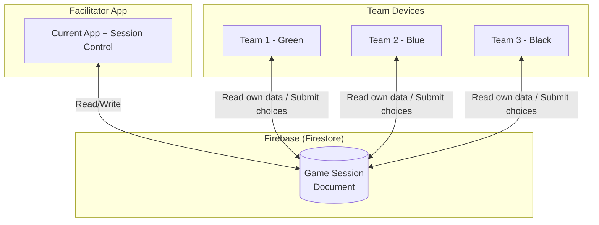

# Team Module Proposal — Evalu8 Smart Board Game Simulation

## The Problem

Currently, the app is a **single-user, Facilitator-only tool**. The workflow is:

1. Teams discuss and make decisions at their tables
2. Teams verbally communicate choices to the Facilitator
3. The Facilitator manually inputs everything into the dashboard
4. The Facilitator progresses through phases, entering data on behalf of all teams

This works, but creates bottlenecks — the facilitator is the single point of input, teams can't see their own state independently, and verbal communication of numbers (combination 4, position 7, allocate 2 research to GPS...) is error-prone.

---

## What I Propose: A Connected Team App

A **secondary app/view** where each team gets their own device (tablet/phone/laptop) to:
- Submit their own decisions directly
- See their own game state in real-time
- Track their progress, finances, and strategy

The Facilitator app remains the **authoritative control centre** — it receives team submissions, can approve/override, and drives the phase progression. Teams never control the game flow.

---

## Architecture: Three Options

### Option A: Shared Database (Firebase) — ⭐ Recommended



**How it works:**
- Facilitator creates a "Session" → generates a **join code** (e.g., `GAME-7X42`)
- Teams join by entering the code on their devices
- All data syncs through Firestore real-time listeners
- Facilitator remains the authority: approves submissions, advances phases

**Pros:** Real-time sync, persistence (game survives refresh!), scales naturally, you already have Firebase experience

**Cons:** Requires Firebase setup, needs auth rules, adds cloud dependency

---

### Option B: WebSocket / Peer-to-Peer (Same Network)

The Facilitator device acts as the "server" and team devices connect directly.

**Pros:** No cloud dependency, works offline, zero cost

**Cons:** All devices must be on same network, facilitator's device is the server (if it crashes, game is lost), more complex setup for non-technical facilitators

---

### Option C: Simple QR Code / URL Sharing (Read-Only Teams)

A lightweight middle ground — teams get a **read-only view** of their own data via a shared URL. The Facilitator still inputs everything, but teams can follow along on their own screens.

**Pros:** Simplest to build, minimal changes to existing app

**Cons:** Teams still can't submit their own choices, still have the verbal bottleneck

---

## Recommended Approach: Option A (Firebase)

Given that you already have Firebase experience and the app currently has **no persistence** (a major limitation), adding Firebase would solve two problems at once:
1. **Game state persistence** — games survive page refresh
2. **Multi-device connectivity** — teams get their own interface

---

## Team App — What Teams Would See & Do

### Phase-by-Phase Team Experience

| Phase | What Teams Do | What Facilitator Sees |
|-------|---------------|----------------------|
| **Planning** | Select their combination + position, choose card usage, hit "Submit" | Sees submitted plans appear. Can approve, request resubmission, or override |
| **Improvement** | View their allocated cards (read-only, facilitator draws) | Draws cards, allocates as current |
| **Research** | Allocate their research icons across technologies, submit | Sees allocations arrive in play order. Can approve or adjust |
| **Logistics** | Choose regions to expand into, allocate points, submit | Sees expansions arrive. Can approve or adjust |
| **Sales** | Select which customers to sell to from eligible list, submit | Sees sales choices in play order. Can approve or adjust |
| **Control** | View results (read-only, auto-calculated) | Same as current — reviews and applies |

### Team Dashboard — Always-Visible Info

Each team would have a persistent sidebar/header showing:
- 📊 **Current price**, products produced, revenue
- 🗺️  **Regions** with presence (mini map?)
- 🔬 **Technologies** researched & in progress
- 🃏 **Improvement cards** in hand
- 💰 **Financial summary** (revenue, control points, total money)
- 📈 **Team rank** vs other teams (without revealing exact opponent details)

---

## Data Flow Design

```
┌──────────────────────────────────────────────────────────┐
│                    Firestore Database                     │
│                                                          │
│  sessions/{sessionId}                                    │
│  ├── status: "planning" | "improvement" | "research"...  │
│  ├── currentRound: 2                                     │
│  ├── facilitatorId: "user123"                            │
│  ├── joinCode: "GAME-7X42"                               │
│  │                                                       │
│  ├── teams/{teamId}                                      │
│  │   ├── name, color, currentState                       │
│  │   └── submissions/{round}                             │
│  │       ├── planning: {combination, position, cards...}  │
│  │       ├── research: {allocations...}                   │
│  │       ├── logistics: {expansions...}                   │
│  │       └── sales: {customers...}                        │
│  │                                                       │
│  ├── gameState (authoritative, written by facilitator)    │
│  │   ├── rounds, patents, technologies, regionLogistics   │
│  │   └── improvementCards, teamProgress...                │
│  │                                                       │
│  └── phaseControl                                        │
│      ├── currentPhase, lockedTeams                        │
│      └── approvedSubmissions                              │
└──────────────────────────────────────────────────────────┘
```

**Key principle:** Teams write to `teams/{teamId}/submissions/`, Facilitator reads those, and writes the authoritative `gameState`. Teams read from `gameState` for their view. This prevents teams from manipulating game state.

---

## Implementation Strategy — Phased Approach

### Phase 1: Add Persistence (Foundation) 🔧
- Add Firebase/Firestore to the existing app
- Persist [GameState](file:///Users/briansimelane/Desktop/Products2026/evalu8smart2026/src/types/game.ts#82-100) to Firestore (save/load)
- This alone is a huge win — games survive page refresh
- **Effort: Medium | Impact: High**

### Phase 2: Session Management 🔗
- Create/join session with codes
- Facilitator creates session → gets join code
- Simple "Join" page for teams
- Role-based routing: facilitator → current dashboard, team → team view
- **Effort: Medium | Impact: High**

### Phase 3: Team Read-Only View 👁️
- Teams can see their own state in real-time
- Current financials, regions, technologies, cards
- Scoreboard position (limited opponent info)
- No input yet — facilitator still enters everything
- **Effort: Low | Impact: Medium**

### Phase 4: Team Input — Planning Phase ✍️
- Teams submit their own combination + position + card choices
- Facilitator sees submissions appear, can approve/reject
- Start with just Planning since it's the highest-volume input
- **Effort: Medium | Impact: High**

### Phase 5: Team Input — All Phases ✍️
- Extend to Research, Logistics, Sales submissions
- Play-order enforcement (teams submit in order)
- Facilitator approval workflow for each phase
- **Effort: High | Impact: High**

### Phase 6: Polish & Enhancements ✨
- Waiting room / lobby before game starts
- Real-time phase transition animations
- Push notifications ("It's your turn to submit Research")
- Team chat or messaging
- Spectator mode for observers
- **Effort: Medium | Impact: Medium**

---

## Key Design Decisions to Consider

### 1. Same App or Separate App?
> **Recommendation: Same app, different routes.**
> 
> - `/facilitator` → current dashboard (requires facilitator auth)
> - `/team/:sessionId/:teamId` → team view
> - `/join` → join session page
> 
> This keeps shared code (types, data, utilities, UI components) in one place.

### 2. How Much Can Teams See About Other Teams?
> Common board game approach: teams see the **scoreboard** (rankings) but NOT other teams' specific strategies (combination choices, research allocations in progress, etc.). The facilitator sees everything.

### 3. Does the Facilitator Still Need to Approve?
> **Yes, for game integrity.** The facilitator should be able to:
> - See team submissions before they're applied
> - Reject/request resubmission if there's an error
> - Override if needed (e.g., team made a mistake)
> - But also have an "auto-approve" toggle for faster games

### 4. What About Play Order?
> In the team app, the Research/Logistics/Sales phases must respect play order. Teams see a "waiting" state until it's their turn, then get prompted to submit. This naturally enforces the order without verbal coordination.

### 5. Offline / Low Connectivity?
> Firebase has offline persistence — if a team's device loses connection momentarily, data syncs when reconnected. The facilitator app can also show connection status per team.

---

## What Changes in the Existing Facilitator App?

The good news: **very little needs to change in the core logic.** The main additions are:

| Change | Description |
|--------|-------------|
| **Firebase integration** | Layer underneath `GameContext` to sync state |
| **Session management** | Create/join game sessions |
| **Submission inbox** | Facilitator sees incoming team submissions |
| **Phase locking** | Control which phase teams can submit to |
| **Connection status** | Show which teams are online |

The existing phase components, calculations, data files, and game logic remain exactly as they are. The Facilitator app would gain a "submission queue" overlay where team submissions appear, and the facilitator can approve them (which essentially auto-fills the existing forms).

---

## Summary

| Aspect | Current State | With Team Module |
|--------|--------------|-----------------|
| Input method | Facilitator types everything | Teams submit, facilitator approves |
| Persistence | None (lost on refresh) | Firestore (persistent) |
| Devices | 1 (facilitator only) | 1 facilitator + 1 per team |
| Error risk | High (verbal communication) | Low (direct digital input) |
| Speed | Slow (sequential input) | Fast (parallel submissions) |
| Team engagement | Low (waiting for facilitator) | High (active participation) |
| Scalability | Limited by facilitator speed | Teams work independently |

